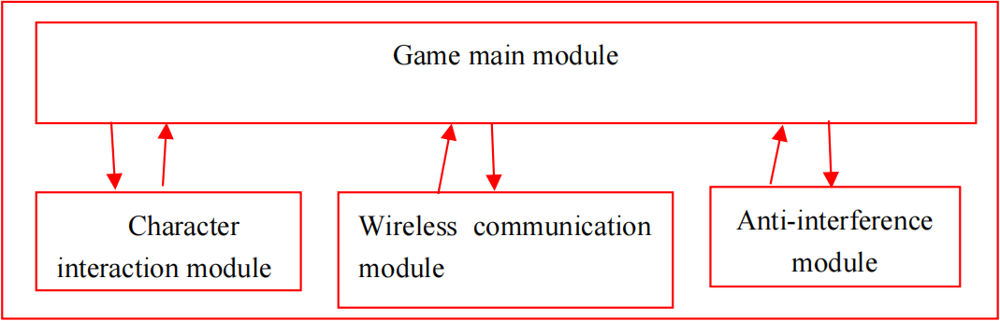
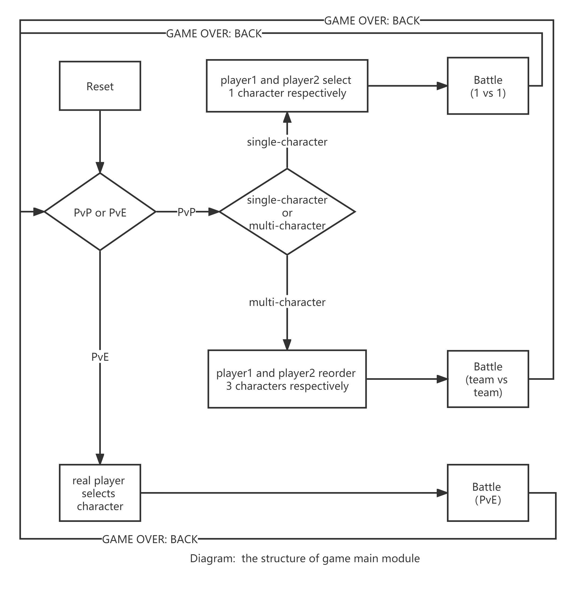
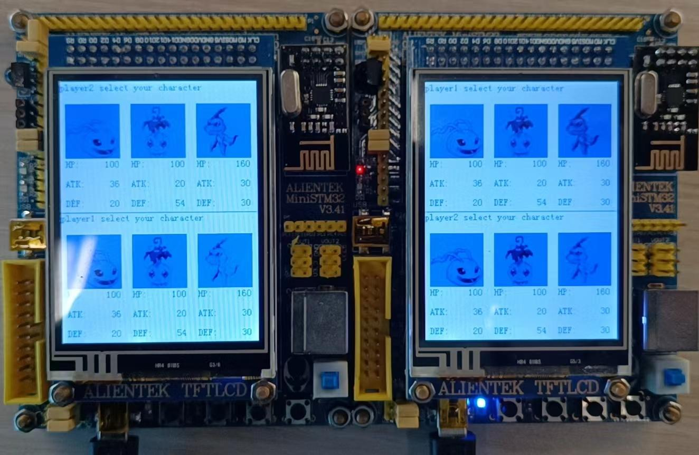
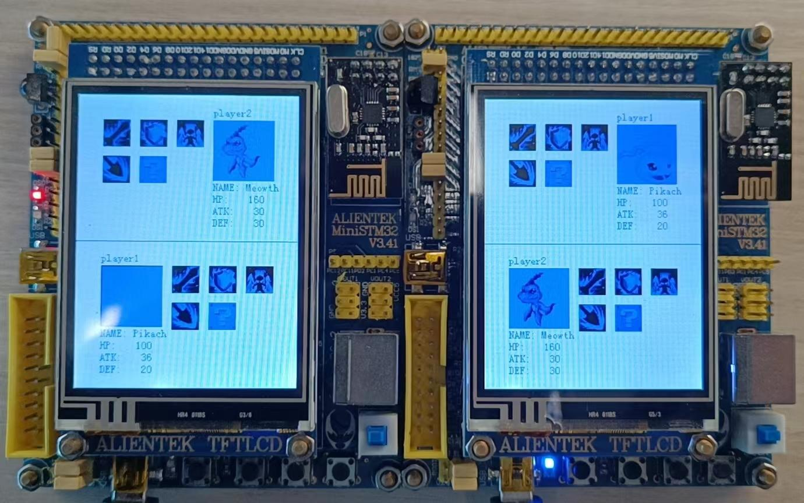
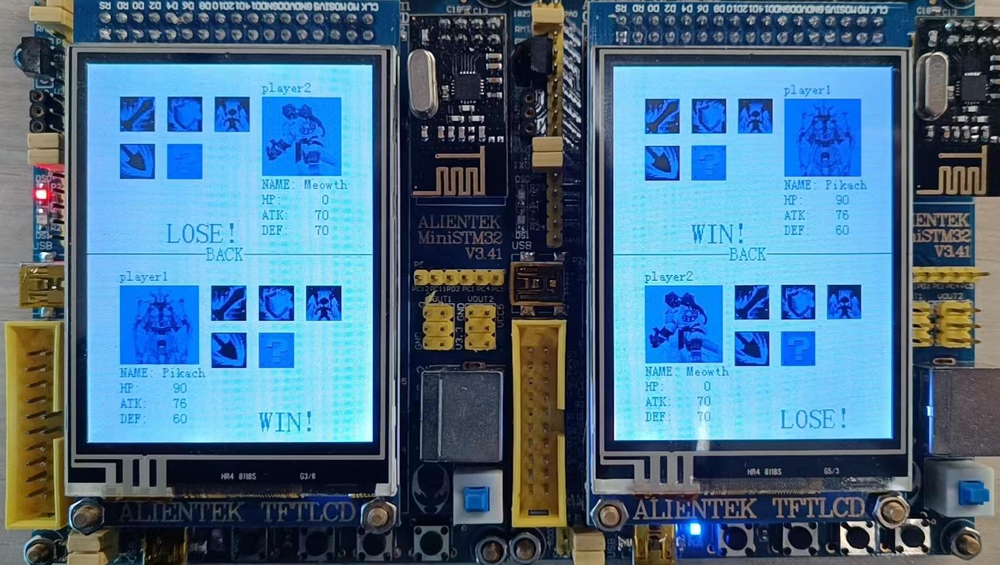
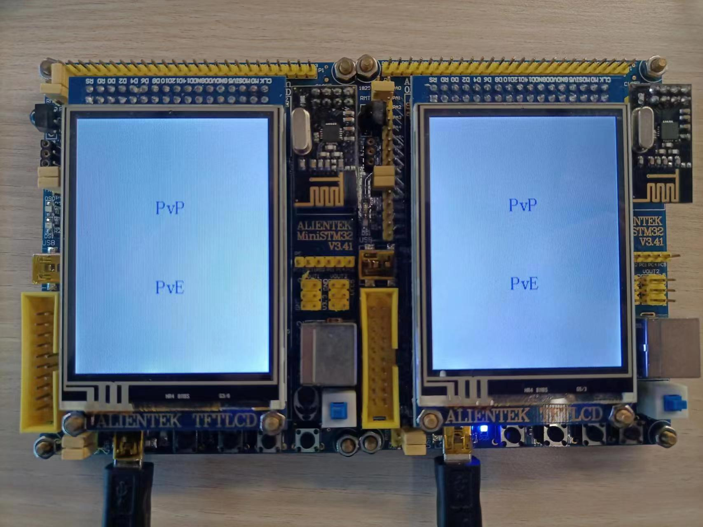

## TBG Battle System

### System Function

We’re designed a TBG battle system. The TBG battle system allows players to select attack, defense, skills, or props at  each turn in  order to  defeat their opponents. The  system  features a range  of **customizable game characters**, each with their **own unique attributes** such as name, head portrait, attack power, defense power, and special skills. Players can select their characters using the touch screen interface, and the attributes of the selected characters are displayed on the LCD screen.

During gameplay, players can use the **touch screen to attack, defend, and use special skills against their opponents**. The system tracks the life points (HP) of each character and determines victories and defeats based on when a character's HP is equal to or less than 0. The information of victory and defeat is displayed on the LCD screen.

The  TBG  battle   system  also  includes  a  **wireless  communication  module  that  allows  for  close  range multiplayer matches**. Players can use their own miniSTM32 boards to battle against each other in real-time, with the screen of each side displaying the information of both players. The system uses a reasonable communication scheme to ensure the accuracy of the data transmitted during the online matchmaking process.

### System Design

### Results (screenshots and hardware photos)

##### (1) Game characters and attributes design + More different characters to be selected

##### (2) Battle via wireless module + Touch screen operation

##### (3) Winning and losing judgment

##### (4) More attack or defense skills for one character

    

        
    

    

        
    

    

        
    

    

        
    

    

        
    

    

        
    

    

        
    

    

        
    

##### (5) PvE & PvP

